# 🏛️ TÀI LIỆU KIẾN TRÚC & LUỒNG HOẠT ĐỘNG TOÀN DIỆN
## Distributed Enterprise E-Commerce Platform

> **Phiên bản tài liệu**: `1.0.0`  
> **Ngày phê duyệt**: 2026-09-30  
> **Chuẩn cơ sở kỹ thuật**:
> - Đặc tả yêu cầu: [`docs/distributed_e-commerce_final-srs.md`](docs/distributed_e-commerce_final-srs.md)
> - Hồ sơ công nghệ: [`docs/tech_profile.yaml`](docs/tech_profile.yaml)

---

## 📑 MỤC LỤC
1. [Triết lý & Nguyên tắc Thiết kế Kiến trúc](#1-triết-lý--nguyên-tắc-thiết-kế-kiến-trúc)
2. [Sơ đồ Kiến trúc Tổng thể (System Topology)](#2-sơ-đồ-kiến-trúc-tổng-thể-system-topology)
3. [Phân rã Hệ thống & Bản đồ Dịch vụ (Service Decomposition)](#3-phân-rã-hệ-thống--bản-đồ-dịch-vụ-service-decomposition)
   - [3.1 Shared Technical Kernel (`services:common`)](#31-shared-technical-kernel-servicescommon)
   - [3.2 Technical Infrastructure Services](#32-technical-infrastructure-services)
   - [3.3 12 Business Microservices](#33-12-business-microservices)
4. [Tầng Hạ tầng Dữ liệu & Lưu trữ (Data & Infrastructure Tier)](#4-tầng-hạ-tầng-dữ-liệu--lưu-trữ-data--infrastructure-tier)
5. [Các Máy trạng thái & Bất biến Nghiệp vụ (State Machines & Invariants)](#5-các-máy-trạng-thái--bất-biến-nghiệp-vụ-state-machines--invariants)
   - [5.1 Máy trạng thái Đơn hàng (Order State Machine)](#51-máy-trạng-thái-đơn-hàng-order-state-machine)
   - [5.2 Máy trạng thái Giữ hàng Tồn kho (Inventory Reservation State Machine)](#52-máy-trạng-thái-giữ-hàng-tồn-kho-inventory-reservation-state-machine)
   - [5.3 Máy trạng thái Vận chuyển (Shipment State Machine)](#53-máy-trạng-thái-vận-chuyển-shipment-state-machine)
   - [5.4 Máy trạng thái Giao dịch Thanh toán (Payment State Machine)](#54-máy-trạng-thái-giao-dịch-thanh-toán-payment-state-machine)
   - [5.5 Máy trạng thái Bản ghi Ngoại lệ (Exception Record State Machine)](#55-máy-trạng-thái-bản-ghi-ngoại-lệ-exception-record-state-machine)
   - [5.6 Các Bảng Sổ cái Bất biến (Immutable Ledgers)](#56-các-bảng-sổ-cái-bất-biến-immutable-ledgers)
6. [Chi tiết Các Luồng Hoạt động Chính (End-to-End Workflows)](#6-chi-tiết-các-luồng-hoạt-động-chính-end-to-end-workflows)
   - [Luồng 1: Xác thực & Cấp quyền JWT (Authentication & RBAC)](#luồng-1-xác-thực--cấp-quyền-jwt-authentication--rbac)
   - [Luồng 2: Xem Danh mục & Đồng bộ Giỏ hàng (Catalog & Cart)](#luồng-2-xem-danh-mục--đồng-bộ-giỏ-hàng-catalog--cart)
   - [Luồng 3: Đặt hàng & Điều phối Saga Thành công (Happy Path Checkout)](#luồng-3-đặt-hàng--điều-phối-saga-thành-công-happy-path-checkout)
   - [Luồng 4: Xử lý Thất bại & Bồi hoàn Saga (Saga Compensation Flow)](#luồng-4-xử-lý-thất-bại--bồi-hoàn-saga-saga-compensation-flow)
   - [Luồng 5: Đóng gói, Vận chuyển & Giao hàng (Fulfillment Lifecycle)](#luồng-5-đóng-gói-vận-chuyển--giao-hàng-fulfillment-lifecycle)
   - [Luồng 6: Mẫu hình Transactional Outbox & Kafka Dispatch](#luồng-6-mẫu-hình-transactional-outbox--kafka-dispatch)
   - [Luồng 7: Bảng Triage Ngoại lệ & Đối soát Thanh toán Thủ công](#luồng-7-bảng-triage-ngoại-lệ--đối-soát-thanh-toán-thủ-công)
   - [Luồng 8: Cấu hình Động & Kiểm soát Phiên bản Bất biến](#luồng-8-cấu-hình-động--kiểm-soát-phiên-bản-bất-biến)
7. [Chiến lược Chịu lỗi, Khả năng Phục hồi & Giám sát (Resilience & Observability)](#7-chiến-lược-chịu-lỗi-khả-năng-phục-hồi--giám-sát-resilience--observability)
8. [Ma trận Truy vết Quy tắc Nghiệp vụ (Business Rules Traceability Matrix)](#8-ma-trận-truy-vết-quy-tắc-nghiệp-vụ-business-rules-traceability-matrix)

---

## 1. Triết lý & Nguyên tắc Thiết kế Kiến trúc

Kiến trúc của hệ thống được xây dựng dựa trên các nguyên tắc thiết kế hệ thống phân tán cấp độ doanh nghiệp (Enterprise Distributed Architecture):

1. **Phân rã Dịch vụ theo Năng lực Nghiệp vụ (Business Capability-Driven Boundaries)**:
   - Các dịch vụ được chia tách theo ranh giới nghiệp vụ thực tế (Identity, Catalog, Pricing, Cart, Inventory, Order, Payment, Fulfillment, v.v.).
   - Tuyệt đối **không** tạo microservice theo vai trò người dùng (không có "Admin Service" riêng) và **không** tạo microservice theo từng bảng entity đơn lẻ.
2. **Cách ly Dữ liệu Tuyệt đối (Database-per-Service Pattern)**:
   - Mỗi microservice sở hữu toàn quyền một cơ sở dữ liệu logic riêng biệt.
   - Nghiêm cấm hoàn toàn: shared database, cross-database joins, cross-database foreign keys, hoặc truy vấn trực tiếp vào database của dịch vụ khác. Mọi trao đổi dữ liệu bắt buộc phải qua API hoặc Message Broker.
3. **Mẫu hình Giao dịch Phân tán Saga (Orchestration Saga)**:
   - Thay thế giao dịch 2 pha (2PC - bị cấm trong hệ thống phân tán hiệu năng cao) bằng mô hình **Saga Orchestration**. `order-service` đóng vai trò điều phối các bước nghiệp vụ và kích hoạt bồi hoàn (Compensating Transactions) khi có bước thất bại.
4. **Đảm bảo Tính nhất quán Eventual Consistency & Chống Mất mát Dữ liệu**:
   - Sử dụng **Transactional Outbox Pattern**: Lưu trữ sự kiện cần xuất bản vào bảng `outbox_events` trong cùng một giao dịch ACID với dữ liệu thực thể, triệt tiêu bài toán **Dual-Write Problem**.
   - Phân phối tin cậy với Apache Kafka đạt ngữ nghĩa **At-Least-Once Delivery**. Phía Consumer thực thi mẫu hình **Idempotent Consumer** để an toàn trước các bản tin lặp lại.
5. **Khả năng Phục hồi & Chống Lỗi Dây chuyền (Resilience & Circuit Breaking)**:
   - Tích hợp **Resilience4j** cho các cuộc gọi đồng bộ REST: Timeouts nghiêm ngặt, Circuit Breakers ngắt mạch nhanh khi downstream quá tải, Exponential Backoff Retries chỉ áp dụng cho thao tác an toàn/idempotent.
6. **Bảo mật Đa tầng & Phòng thủ Chiều sâu (Defense-in-Depth Security)**:
   - Gateway đóng vai trò kiểm tra thô (Coarse-grained token validation, routing, correlation injection).
   - Từng Microservice thực thi kiểm soát phân quyền chuyên sâu (Fine-grained authoritative RBAC & Resource Ownership Check). Không bao giờ tin tưởng quyền hạn gửi thẳng từ phía client.
7. **Quan sát Toàn diện (Full-Stack Observability)**:
   - Mỗi yêu cầu được gán một mã định danh duy nhất `X-Correlation-Id` ngay tại Gateway, được truyền qua SLF4J MDC, OpenTelemetry Traces, Header HTTP liên dịch vụ và Kafka Event Headers.
   - Chuẩn hóa lỗi theo đặc tả **RFC 7807 Problem Details**.

---

## 2. Sơ đồ Kiến trúc Tổng thể (System Topology)

```mermaid
flowchart TB
    subgraph Clients["TẦNG ỨNG DỤNG KHÁCH (FRONTEND)"]
        Storefront["Storefront Web (user-web)<br/>Next.js 15 App Router | React 19<br/>Port: 3000"]
        Backoffice["Backoffice Portal (admin-web)<br/>Vite 7 SPA | React 19 | RBAC<br/>Port: 5173"]
    end

    subgraph GatewayDiscovery["TẦNG ĐỊNH TUYẾN & ĐIỀU PHỐI (GATEWAY & DISCOVERY)"]
        Gateway["API Gateway (Spring Cloud Gateway)<br/>Port: 8080 | CorrelationFilter | CORS"]
        Eureka["Service Discovery (Netflix Eureka)<br/>Port: 8761 | Dynamic Registry"]
    end

    Storefront -->|HTTP REST / JWT| Gateway
    Backoffice -->|HTTP REST / JWT| Gateway
    Gateway -.->|Tra cứu định tuyến| Eureka

    subgraph CoreServices["TẦNG MICROSERVICES NGHIỆP VỤ (BACKEND)"]
        direction TB
        Identity["Identity & Access Service<br/>Port: 8081"]
        Catalog["Catalog Service<br/>Port: 8082"]
        Pricing["Pricing Service<br/>Port: 8083"]
        Cart["Cart Service<br/>Port: 8084"]
        Inventory["Inventory Service<br/>Port: 8085"]
        Order["Order Service (Saga Coordinator)<br/>Port: 8086"]
        Payment["Payment Service<br/>Port: 8087"]
        Fulfillment["Fulfillment Service<br/>Port: 8088"]
        Notification["Notification Service<br/>Port: 8089"]
        Audit["Audit & Compliance Service<br/>Port: 8090"]
        Config["Business Configuration Service<br/>Port: 8091"]
        ExceptionSvc["Exception Management Service<br/>Port: 8092"]
    end

    Gateway -->|/api/v1/auth/**| Identity
    Gateway -->|/api/v1/products/**| Catalog
    Gateway -->|/api/v1/prices/**| Pricing
    Gateway -->|/api/v1/cart/**| Cart
    Gateway -->|/api/v1/inventory/**| Inventory
    Gateway -->|/api/v1/orders/**| Order
    Gateway -->|/api/v1/payments/**| Payment
    Gateway -->|/api/v1/shipments/**| Fulfillment
    Gateway -->|/api/v1/notifications/**| Notification
    Gateway -->|/api/v1/backoffice/audit-log/**| Audit
    Gateway -->|/api/v1/backoffice/configurations/**| Config
    Gateway -->|/api/v1/backoffice/exceptions/**| ExceptionSvc

    subgraph EventAndCache["TẦNG TRUYỀN THÔNG SỰ KIỆN & BỘ NHỚ ĐỆM"]
        Kafka["Apache Kafka Message Bus<br/>Port: 9092<br/>(order.events, payment.events, etc.)"]
        Redis["Redis In-Memory Data Store<br/>Port: 6379<br/>(Cart Session, Distributed Lock)"]
    end

    Order -.->|Outbox Dispatch| Kafka
    Inventory -.->|Outbox Dispatch| Kafka
    Payment -.->|Outbox Dispatch| Kafka
    Fulfillment -.->|Outbox Dispatch| Kafka
    Kafka -.->|Subscribe Events| Notification
    Kafka -.->|Subscribe Events| Audit
    Kafka -.->|Subscribe Events| ExceptionSvc

    Cart --> Redis
    Inventory -->|Distributed Lock| Redis

    subgraph Storage["TẦNG LƯU TRỮ CƠ SỞ DỮ LIỆU & OBJECTS"]
        Postgres[("PostgreSQL 16 Engine<br/>12 Isolated Logical Databases<br/>Port: 5432")]
        MinIO["MinIO S3 Storage<br/>Product Media & Assets<br/>Port: 9000/9001"]
    end

    Catalog --> MinIO
    CoreServices --> Postgres

    subgraph Observability["TẦNG QUAN SÁT & TELEMETRY"]
        OTel["OTel Collector<br/>Port: 4317/4318"]
        Prometheus["Prometheus<br/>Port: 9090"]
        Tempo["Grafana Tempo<br/>Port: 3200"]
        Grafana["Grafana UI<br/>Port: 3000"]
    end

    CoreServices -.->|Actuator Metrics| Prometheus
    CoreServices -.->|OTel Tracing| OTel
    OTel --> Tempo
    Prometheus --> Grafana
    Tempo --> Grafana
```

---

## 3. Phân rã Hệ thống & Bản đồ Dịch vụ (Service Decomposition)

### 3.1 Shared Technical Kernel (`services:common`)
Module dùng chung cung cấp các thành phần kỹ thuật chuẩn hóa, bảo đảm tính nhất quán trên cả 15 subprojects:
- **`CorrelationContext` & `CorrelationIdFilter`**: Trích xuất hoặc tự sinh UUIDv4 `X-Correlation-Id`, đưa vào `ThreadLocal` và SLF4J MDC (`correlationId`), truyền tiếp sang response header.
- **`ApiErrorResponse` & `GlobalExceptionHandler`**: Cấu trúc lỗi chuẩn hóa theo đặc tả **RFC 7807 Problem Details** gồm: `type`, `title`, `status`, `detail`, `instance`, `timestamp`, `invalidParams`.
- **Hệ thống Ngoại lệ Miền (Domain Exceptions)**:
  - `BusinessRuleException(ruleId, message)`: Gắn trực tiếp mã luật SRS (ví dụ: `BR-001`, `BR-006`, `BR-018`).
  - `NotFoundException` (HTTP 404), `ConflictException` (HTTP 409), `InvalidStateException` (HTTP 422), `DependencyException` (HTTP 502/503).
- **`EventEnvelope<T>`**: Vỏ bọc tin nhắn Kafka tiêu chuẩn: `eventId`, `eventType`, `aggregateType`, `aggregateId`, `correlationId`, `timestamp`, `version`, `payload`.
- **`OutboxStatus`**: Vòng đời trạng thái Outbox (`PENDING`, `PROCESSED`, `FAILED`).

---

### 3.2 Technical Infrastructure Services

#### 1. Service Discovery (`services:service-discovery`)
- **Công nghệ**: Spring Cloud Netflix Eureka Server (Port: `8761`).
- **Nhiệm vụ**: Quản lý đăng ký (Service Registration) và phân giải địa chỉ IP/Port linh hoạt (Dynamic Discovery) cho toàn bộ microservices. Cấu hình tắt chế độ tự bảo vệ (`enable-self-preservation: false`) trong profile local để thu hồi instance nhanh chóng.

#### 2. API Gateway (`services:api-gateway`)
- **Công nghệ**: Spring Cloud Gateway (Port: `8080`), Non-blocking Reactive WebFlux.
- **Nhiệm vụ**:
  - Điểm vào ngoại vi duy nhất (Single Ingress Point) cho cả Storefront và Backoffice.
  - Phân luồng định tuyến động qua Eureka (`lb://<service-name>`).
  - Đóng dấu correlation: Tự động inject `X-Correlation-Id` nếu client chưa truyền.
  - Thiết lập chính sách CORS cho Storefront (`http://localhost:3000`) và Backoffice (`http://localhost:5173`).
  - **Quy tắc cấm tuyệt đối**: Không chứa logic nghiệp vụ, không kết nối cơ sở dữ liệu, không điều phối state machine.

---

### 3.3 12 Business Microservices

| # | Microservice | Port | Cơ sở dữ liệu logic | Ranh giới Trách nhiệm Nghiệp vụ | Bảng Dữ liệu Chính |
|---|---|---|---|---|---|
| **1** | `identity-access-service` | `8081` | `identity_access_db` | Quản lý tài khoản, mật khẩu băm BCrypt, JWT Bearer tokens, sổ địa chỉ khách hàng, phân quyền RBAC 5 vai trò. | `user_account`, `customer_address`, `role`, `permission`, `user_role`, `role_permission`, `outbox_events` |
| **2** | `catalog-service` | `8082` | `catalog_db` | Danh mục sản phẩm đa cấp, sản phẩm cha, biến thể SKU, thuộc tính động, liên kết hình ảnh media MinIO. | `categories`, `products`, `product_attributes`, `product_attribute_values`, `skus`, `product_media` |
| **3** | `pricing-service` | `8083` | `pricing_db` | Biểu giá gốc theo SKU, tiền tệ, các chiến dịch khuyến mãi chiết khấu, tính toán giá bán cuối cùng. | `prices`, `promotions`, `outbox_events` |
| **4** | `cart-service` | `8084` | `cart_db` (+ Redis) | Quản lý giỏ hàng khách hàng, thêm/sửa/xóa item, áp dụng TTL session giỏ hàng, đồng bộ với Redis. | `carts`, `cart_items` |
| **5** | `inventory-service` | `8085` | `inventory_db` (+ Redis) | Quản lý tồn kho thực tế/khả dụng, giữ hàng (Reservation) có thời hạn TTL (BR-004), phân bổ FIFO (BR-005), khóa phân tán Redis. | `inventories`, `inventory_reservations`, `inventory_adjustment_logs` (Append-Only), `outbox_events` |
| **6** | `order-service` | `8086` | `order_db` | Vòng đời đơn hàng, kiểm soát máy trạng thái nghiêm ngặt, điều phối Saga Orchestration, tính tổng tiền. | `orders`, `order_items`, `order_timeline_events` (Append-Only), `outbox_events` |
| **7** | `payment-service` | `8087` | `payment_db` | Khởi tạo giao dịch thanh toán, cổng tích hợp, kiểm tra tính lũy kế (Idempotency BR-002), đối soát thủ công có bằng chứng (BR-012). | `payment_transactions`, `outbox_events` |
| **8** | `fulfillment-service` | `8088` | `fulfillment_db` | Quản lý vận đơn, trạng thái đóng gói, rào chắn mã vận đơn/nhà vận chuyển bắt buộc trước khi xuất kho (BR-011). | `shipments`, `outbox_events` |
| **9** | `notification-service` | `8089` | `notification_db` | Quản lý mẫu thông báo (template), tiêu thụ sự kiện Kafka để tạo nội dung email/SMS và lưu vết lịch sử gửi. | `notification_templates`, `notification_logs`, `outbox_events` |
| **10**| `audit-compliance-service`| `8090` | `audit_compliance_db` | Thu thập toàn bộ sự kiện nghiệp vụ hệ thống vào sổ cái kiểm toán bất biến (BR-013), phục vụ thanh tra. | `audit_logs` (Append-Only, Không có API UPDATE/DELETE) |
| **11**| `business-configuration-service`| `8091`| `business_configuration_db` | Quản lý các tham số vận hành runtime (SLA, Timeout, Phí ship) kèm lịch sử phiên bản bất biến (BR-019). | `business_configurations`, `outbox_events` |
| **12**| `exception-management-service` | `8092`| `exception_management_db`| Bảng triage sự cố nghiệp vụ (đơn lỗi, thanh toán treo), chỉ số vận hành dashboard (BR-017, BR-018). | `exception_records`, `outbox_events` |

---

## 4. Tầng Hạ tầng Dữ liệu & Lưu trữ (Data & Infrastructure Tier)

### 4.1 Cơ sở Dữ liệu Quan hệ (PostgreSQL 16)
- **Kiến trúc**: 1 Instance vật lý phục vụ môi trường phát triển, chia thành **12 Logical Databases** hoàn toàn độc lập được tạo bởi script `01-create-databases.sql`.
- **Độ chính xác tiền tệ**: Mọi trường tài chính (`unit_price`, `subtotal`, `discount_amount`, `shipping_fee`, `grand_total`, `amount`) được quy định kiểu `NUMERIC(14, 2)` trong PostgreSQL và `java.math.BigDecimal` trong Java để triệt tiêu lỗi làm tròn dấu phẩy động.
- **Tiến hóa Schema**: 100% thay đổi cấu trúc bảng được quản lý tự động qua **Flyway Migrations** đặt trong `src/main/resources/db/migration/`.

### 4.2 Bộ nhớ Đệm & Khóa Phân tán (Redis 7)
- **Giỏ hàng Session**: Lưu trữ cache giỏ hàng tạm với TTL cấu hình sẵn.
- **Khóa phân tán (Distributed Lock)**: Kiểm soát tranh chấp tài nguyên (Resource Contention) khi nhiều luồng cùng đặt giữ chỗ số lượng tồn kho của cùng một SKU, bảo vệ số dư tồn kho không bị âm (`available_quantity >= 0`).

### 4.3 Message Broker Phân tán (Apache Kafka 3.x)
- **Mô hình Topic**:
  - `order.events`: Sự kiện thay đổi trạng thái đơn (`OrderPlacedEvent`, `OrderPaidEvent`, `OrderCancelledEvent`).
  - `inventory.events`: Sự kiện giữ/giải phóng tồn (`InventoryReservedEvent`, `InventoryReleasedEvent`, `InventoryDepletedEvent`).
  - `payment.events`: Sự kiện thanh toán (`PaymentInitiatedEvent`, `PaymentSuccessEvent`, `PaymentFailedEvent`).
  - `shipment.events`: Sự kiện vận chuyển (`ShipmentCreatedEvent`, `ShipmentShippedEvent`, `ShipmentDeliveredEvent`).
  - `configuration.events`: Sự kiện cập nhật cấu hình hệ thống (`BusinessConfigurationChangedEvent`).
  - `exception.events`: Sự kiện phát sinh ngoại lệ hệ thống (`ExceptionRecordedEvent`).
- **Phân vùng (Partitioning Key)**: Sử dụng Business Aggregate Key (như `order_id`, `sku_id`) làm Partition Key để bảo đảm thứ tự tuần tự nghiêm ngặt của các sự kiện liên quan tới cùng một thực thể.

### 4.4 Lưu trữ Đối tượng S3-Compatible (MinIO)
- Lưu trữ hình ảnh sản phẩm, banner thương hiệu, tài liệu xuất nhập kho.
- Microservice chỉ lưu đường dẫn tương đối (Object Key/URL) trong database PostgreSQL, không bao giờ lưu trữ dữ liệu nhị phân (BLOB) trong database giao dịch.

---

## 5. Các Máy trạng thái & Bất biến Nghiệp vụ (State Machines & Invariants)

### 5.1 Máy trạng thái Đơn hàng (Order State Machine)

Máy trạng thái đơn hàng là trái tim vận hành của hệ thống, được hiện thực trong `com.ecommerce.order.domain.statemachine.OrderStateMachine`:

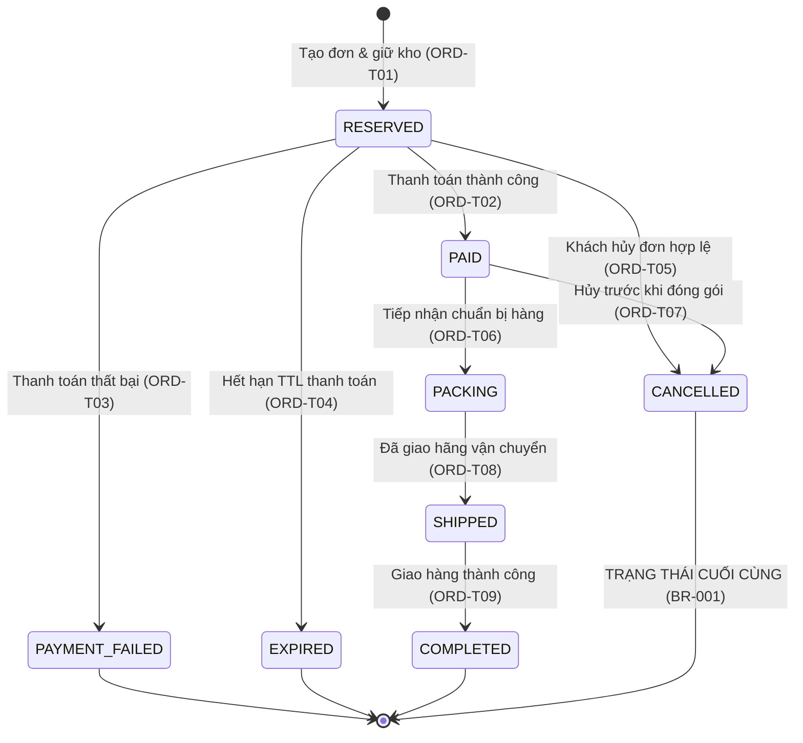

#### Các Bất biến Nghiệp vụ Đơn hàng:
- **BR-001**: `CANCELLED` là trạng thái kết thúc (Terminal State). Bất kỳ yêu cầu chuyển trạng thái nào từ `CANCELLED` sang trạng thái khác đều bị từ chối ngay lập tức bằng `BusinessRuleException("BR-001")`.
- **BR-006 (Điểm Cắt Hủy Đơn)**: Khi đơn hàng đã chuyển sang `PACKING`, đơn hàng **không thể** bị hủy trực tiếp bởi khách hàng hoặc nhân viên mà phải đi qua quy trình ngoại lệ hoặc hoàn hàng. Chuyển dịch `PACKING` -> `CANCELLED` bị nghiêm cấm.
- **BR-007 (Tuần tự Nghiệp vụ)**: Không được phép nhảy cóc trạng thái (ví dụ: không thể chuyển từ `RESERVED` thẳng sang `COMPLETED`). Mọi chuyển dịch phải nằm trong danh mục chuyển dịch hợp lệ (`VALID_TRANSITIONS`).

---

### 5.2 Máy trạng thái Giữ hàng Tồn kho (Inventory Reservation State Machine)

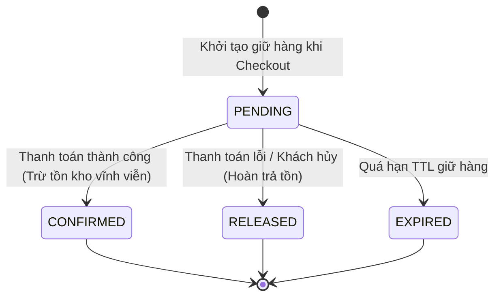

#### Các Bất biến Nghiệp vụ Tồn kho:
- **BR-004 (TTL Giữ hàng)**: Bản ghi giữ chỗ tồn kho có thời hạn sống (`expires_at`), tính toán dựa trên cấu hình động runtime.
- **BR-005 (Phân bổ FIFO)**: Khi xuất kho thực tế, các lô hàng nhập trước (dựa trên `created_at`) sẽ được ưu tiên phân bổ xuất trước.
- **BR-008 (Cân bằng Tồn kho Nguyên tử)**: `available_quantity` chỉ được phép trừ khi `available_quantity >= requested_quantity`. Áp dụng Khóa Lạc quan (Optimistic Locking với cột `@Version`) để bảo vệ chống ghi đè đồng thời.

---

### 5.3 Máy trạng thái Vận chuyển (Shipment State Machine)

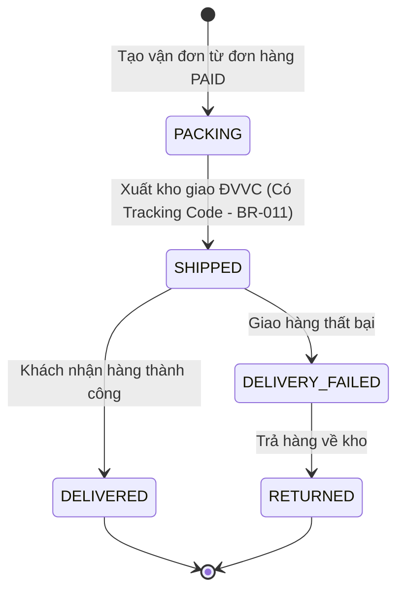

#### Bất biến Vận chuyển:
- **BR-011 (Rào chắn Mã Vận Đơn)**: Yêu cầu chuyển trạng thái sang `SHIPPED` bắt buộc phải có `trackingNumber` và `carrierCode` hợp lệ, không được để trống.

---

### 5.4 Máy trạng thái Giao dịch Thanh toán (Payment State Machine)

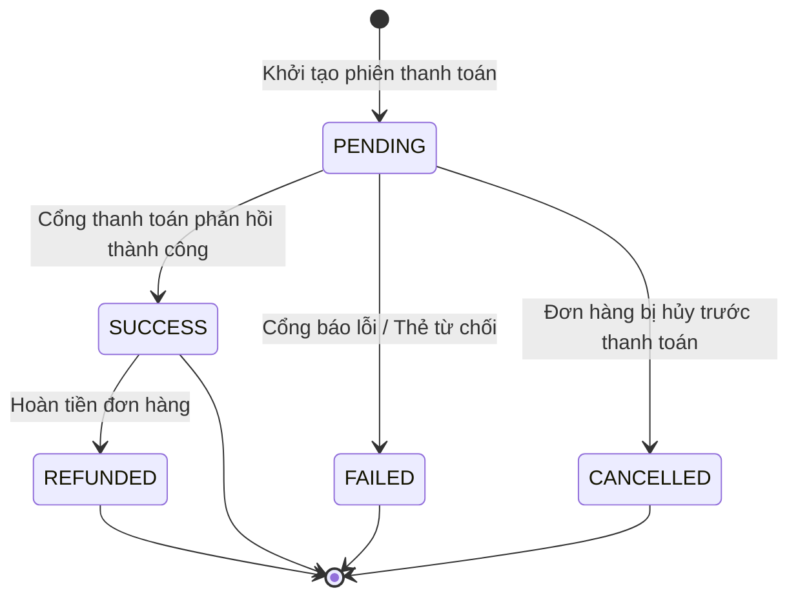

#### Bất biến Thanh toán:
- **BR-002 (Lũy kế Thanh toán - Idempotency)**: Mọi yêu cầu thanh toán và Webhook callback từ cổng thanh toán bắt buộc phải mang `idempotency_key` hoặc kiểm tra `gateway_transaction_id`. Các lượt gọi lặp lại với cùng khóa sẽ trả về kết quả trước đó mà không xử lý trừ tiền lần 2.
- **BR-012 (Đối soát Thủ công Bắt buộc)**: Khi nhân viên vận hành thực hiện điều chỉnh hoặc khớp lệnh thanh toán thủ công, hệ thống bắt buộc yêu cầu `operatorId`, lý do (`reason`), và ghi chú bằng chứng (`evidenceNote`).

---

### 5.5 Máy trạng thái Bản ghi Ngoại lệ (Exception Record State Machine)

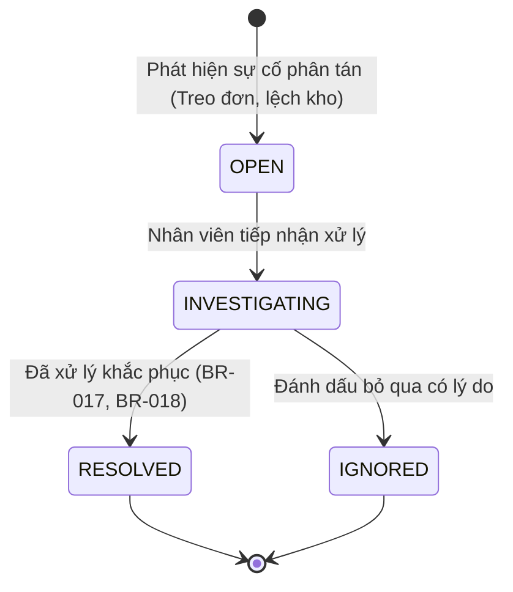

#### Bất biến Ngoại lệ:
- **BR-017**: Bắt buộc phải xác định danh tính nhân viên (`operatorId`) khi tiếp nhận hoặc giải quyết ngoại lệ.
- **BR-018**: Bắt buộc phải có ghi chú giải trình giải pháp (`resolutionNotes`) khi chuyển trạng thái sang `RESOLVED`.

---

### 5.6 Các Bảng Sổ cái Bất biến (Immutable Ledgers)

Nhằm đảm bảo tính minh bạch kiểm toán và tuân thủ tài chính, hệ thống triển khai các bảng cơ sở dữ liệu theo mô hình **Append-Only Ledger** (Chỉ cho phép `INSERT`, cấm hoàn toàn `UPDATE` và `DELETE`):
1. **`audit_log`** (trong `audit_compliance_db`): Ghi nhận toàn bộ thao tác quản trị viên và sự kiện quan trọng của hệ thống (`BR-013`).
2. **`inventory_adjustment_log`** (trong `inventory_db`): Ghi lại biến động tăng/giảm tồn kho, lý do điều chỉnh, số lượng delta, và người thực hiện (`BR-014`).
3. **`order_timeline_event`** (trong `order_db`): Ghi lại từng bước chuyển dịch trạng thái của đơn hàng, thời điểm, tác nhân (Hệ thống, Khách hàng, hay Nhân viên vận hành) (`BR-015`).

---

## 6. Chi tiết Các Luồng Hoạt động Chính (End-to-End Workflows)

### Luồng 1: Xác thực & Cấp quyền JWT (Authentication & RBAC)

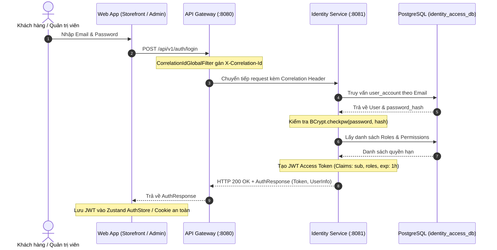

---

### Luồng 2: Xem Danh mục & Đồng bộ Giỏ hàng (Catalog & Cart)

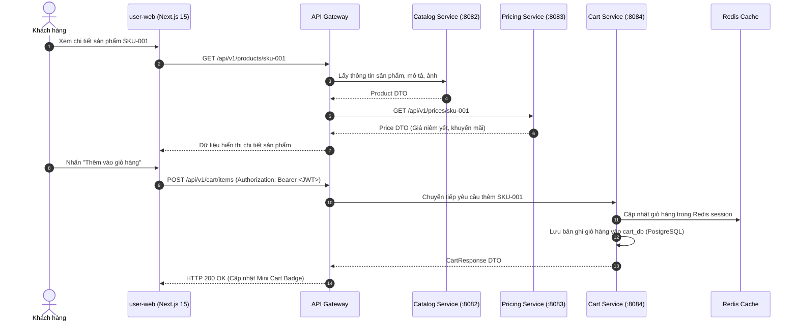

---

### Luồng 3: Đặt hàng & Điều phối Saga Thành công (Happy Path Checkout)

Quy trình checkout là một Saga điều phối phân tán có phối hợp giữa các microservices:

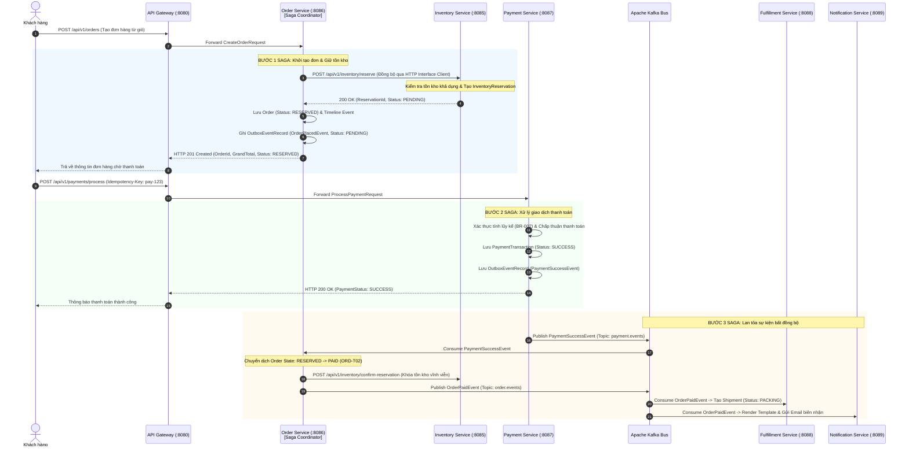

---

### Luồng 4: Xử lý Thất bại & Bồi hoàn Saga (Saga Compensation Flow)

Kịch bản: Khách hàng tạo đơn giữ hàng thành công, nhưng thanh toán bị từ chối hoặc hết thời hạn TTL (Payment Failure / Timeout). Quy trình kích hoạt các bước bồi hoàn (Compensations):

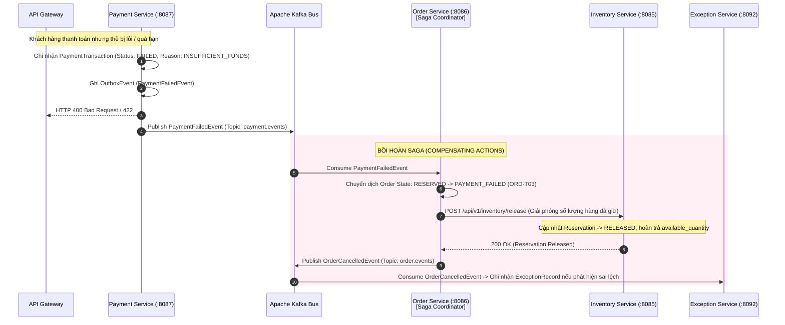

---

### Luồng 5: Đóng gói, Vận chuyển & Giao hàng (Fulfillment Lifecycle)

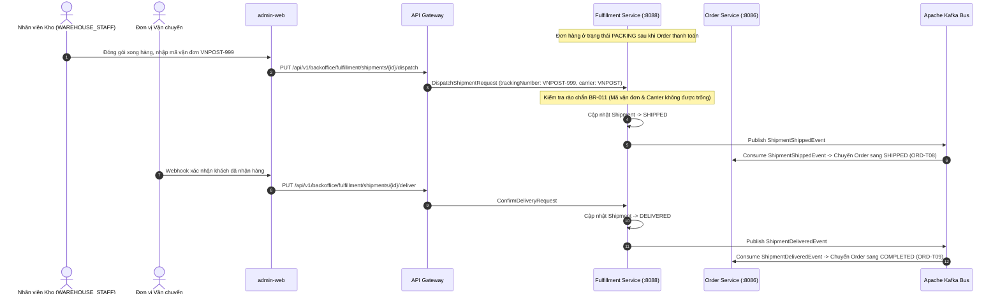

---

### Luồng 6: Mẫu hình Transactional Outbox & Kafka Dispatch

Để đảm bảo tính toàn vẹn tuyệt đối giữa Database cục bộ và Kafka Broker:

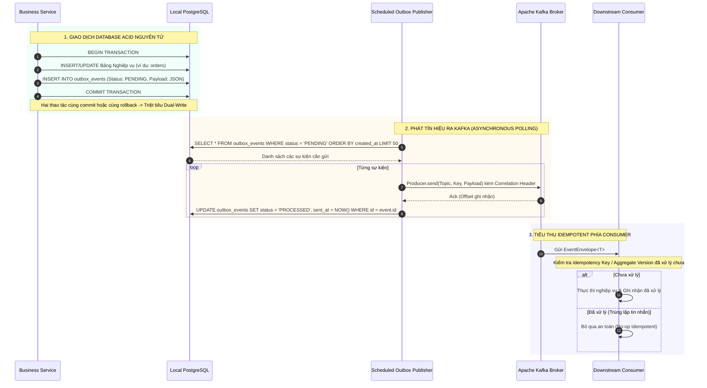

---

### Luồng 7: Bảng Triage Ngoại lệ & Đối soát Thanh toán Thủ công

Xử lý các tình huống biên (Edge cases) cần sự can thiệp của con người theo quy định của SRS:

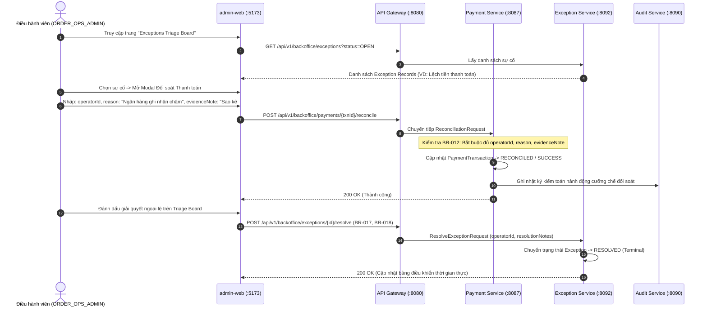

---

### Luồng 8: Cấu hình Động & Kiểm soát Phiên bản Bất biến

Quy định cấu hình runtime (như TTL giữ hàng tồn kho, ngưỡng ngắt mạch) không được hard-code và phải có lịch sử phiên bản bất biến (`BR-019`):

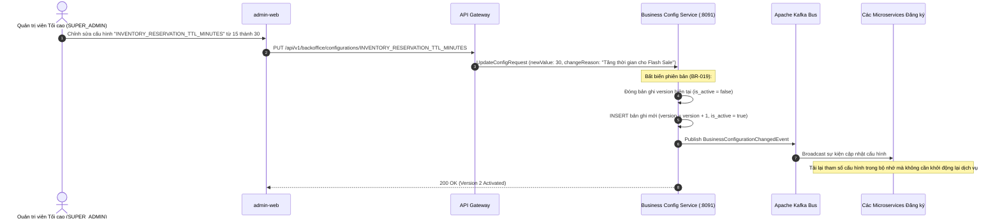

---

## 7. Chiến lược Chịu lỗi, Khả năng Phục hồi & Giám sát (Resilience & Observability)

### 7.1 Cơ chế Phục hồi với Resilience4j
Mỗi microservice khi gọi sang dịch vụ khác qua Spring HTTP Interface Client đều được bọc bởi các lớp bảo vệ:
- **Circuit Breaker (Ngắt mạch tự động)**:
  - Cấu hình cửa sổ trượt: 10 cuộc gọi gần nhất.
  - Ngưỡng lỗi: Nếu tỷ lệ lỗi >= 50%, ngắt mạch chuyển sang trạng thái `OPEN`.
  - Thời gian chờ ở trạng thái mở: 10 giây trước khi thử nghiệm ở trạng thái `HALF-OPEN`.
- **Exponential Backoff Retry**:
  - Tự động thử lại tối đa 3 lần với khoảng cách thời gian tăng dần có gắn thêm nhiễu (Jitter) nhằm tránh dồn sóng tải (Thundering Herd Problem).
  - Chỉ áp dụng Retry đối với các thao tác `GET` an toàn hoặc các API có hỗ trợ tính lũy kế (`idempotency_key`).
- **Graceful Fallback**:
  - Khi ngắt mạch đang mở hoặc dịch vụ downstream không phản hồi, hệ thống trả về lỗi chuẩn hóa RFC 7807 với mã HTTP 503 Service Unavailable, ghi nhận log mức ERROR kèm `correlationId` và bắn cảnh báo về `exception-management-service`.

### 7.2 Distributed Tracing & W3C TraceContext
- **Mã tương quan (Correlation ID)**: Được sinh ra từ Gateway hoặc giữ nguyên từ Header client gửi lên (`X-Correlation-Id`).
- **OpenTelemetry & Grafana Tempo**:
  - Mỗi request HTTP và bản tin Kafka đều đính kèm thông tin W3C Trace Context (`traceparent`).
  - Toàn bộ Span ID và Trace ID được tự động inject vào SLF4J MDC, hiển thị trên từng dòng log JSON có cấu trúc.
  - Kỹ sư vận hành chỉ cần copy `correlationId` hoặc `traceId` từ phản hồi lỗi là có thể tra cứu toàn bộ hành trình gọi liên dịch vụ trên Grafana Tempo.

---

## 8. Ma trận Truy vết Quy tắc Nghiệp vụ (Business Rules Traceability Matrix)

Hệ thống bảo đảm tính truy vết 100% từ đặc tả SRS sang mã nguồn thực thi:

| Mã Luật | Phát biểu Quy tắc Nghiệp vụ (SRS Baseline) | Thành phần Thực thi Mã nguồn | Cơ chế Kiểm soát & Bảo vệ |
|---|---|---|---|
| **BR-001** | Trạng thái `CANCELLED` của Đơn hàng là trạng thái cuối cùng, không thể đảo ngược. | `OrderStateMachine.java` | Ném `BusinessRuleException("BR-001")` nếu cố gắng chuyển từ `CANCELLED`. |
| **BR-002** | Xử lý thanh toán và Webhook callback phải đảm bảo tính lũy kế (Idempotent). | `PaymentController.java` | Kiểm tra `idempotency_key` và trạng thái giao dịch trước khi xử lý. |
| **BR-003** | Khách vãng lai (Guest) không được phép thực hiện Checkout đơn hàng. | `OrderController.java`, `CartController.java` | Bắt buộc `userId` khác rỗng và đã được xác thực qua JWT. |
| **BR-004** | Bản ghi giữ hàng tồn kho (Reservation) có thời hạn sống TTL cấu hình được. | `InventoryReservation.java` | Tính toán `expires_at` và tự động thu hồi khi quá hạn. |
| **BR-005** | Phân bổ xuất kho thực tế theo nguyên tắc nhập trước xuất trước (FIFO). | `Inventory.java` | Sắp xếp các lô tồn kho theo `created_at ASC` khi trừ kho. |
| **BR-006** | Điểm cắt hủy đơn: Không được phép hủy đơn khi đã bước vào giai đoạn `PACKING`. | `OrderStateMachine.java` | Chặn đứng chuyển dịch `PACKING -> CANCELLED`, bắt buộc đi qua luồng ngoại lệ. |
| **BR-007** | Vòng đời đơn hàng phải diễn ra tuần tự, không được nhảy cóc trạng thái. | `OrderStateMachine.java` | Kiểm tra target state dựa trên ma trận `VALID_TRANSITIONS`. |
| **BR-008** | Cân bằng tồn kho nguyên tử: Tồn khả dụng không bao giờ được phép âm. | `Inventory.java` | Khóa phân tán Redis + Khóa lạc quan `@Version` kiểm tra `available >= requested`. |
| **BR-009** | Đảm bảo chuyển giao sự kiện đáng tin cậy qua Transactional Outbox. | `OutboxEventRecord.java` | Lưu bản ghi sự kiện `PENDING` trong cùng giao dịch ACID với thực thể. |
| **BR-010** | Mọi phản hồi lỗi bắt buộc phải tuân theo đặc tả chuẩn RFC 7807 Problem Details. | `ApiErrorResponse.java`, `GlobalExceptionHandler.java` | Bắt toàn bộ ngoại lệ và trả về JSON chuẩn hóa RFC 7807. |
| **BR-011** | Chuyển trạng thái sang `SHIPPED` bắt buộc phải có mã vận đơn và hãng vận chuyển. | `BackofficeFulfillmentController.java` | Xác thực `trackingNumber` và `carrierCode` không được trống. |
| **BR-012** | Khớp lệnh hoặc điều chỉnh thanh toán thủ công bắt buộc phải có vết kiểm toán. | `BackofficePaymentController.java` | Yêu cầu `operatorId`, `reason` và `evidenceNote`. |
| **BR-013** | Sổ cái nhật ký kiểm toán hệ thống là bất biến (Append-Only). | `AuditLog.java`, `AuditLogRepository.java` | Chỉ hỗ trợ thao tác lưu mới, không cung cấp API UPDATE/DELETE. |
| **BR-014** | Lịch sử điều chỉnh số lượng tồn kho là bất biến (Append-Only). | `InventoryAdjustmentLog.java` | Lưu chi tiết từng biến động số lượng vào bảng lịch sử. |
| **BR-015** | Dòng thời gian đơn hàng (Order Timeline) là bất biến (Append-Only). | `OrderTimelineEvent.java` | Tự động ghi nhận mốc thời gian và tác nhân mỗi khi đơn đổi trạng thái. |
| **BR-016** | Bắt buộc lan truyền mã tương quan `X-Correlation-Id` qua toàn bộ hệ thống. | `CorrelationIdFilter.java`, `CorrelationIdGlobalFilter.java` | Đính kèm correlation ID vào Request, Response, Log MDC và Kafka Headers. |
| **BR-017** | Giải quyết sự cố ngoại lệ bắt buộc phải xác định danh tính nhân viên. | `ExceptionRecord.java` | Kiểm tra `operatorId` hợp lệ khi chuyển sang `RESOLVED`. |
| **BR-018** | Giải quyết sự cố ngoại lệ bắt buộc phải có ghi chú giải trình giải pháp. | `ExceptionRecord.java` | Xác thực `resolutionNotes` không được rỗng khi xử lý xong sự cố. |
| **BR-019** | Thay đổi cấu hình vận hành hệ thống phải lưu vết phiên bản bất biến. | `BusinessConfigurationController.java` | Đóng phiên bản cũ và tạo phiên bản `version + 1` mới mỗi khi cập nhật. |

---

*Tài liệu kiến trúc này là tài liệu kỹ thuật chuẩn mực, được cập nhật đồng bộ cùng mã nguồn của hệ thống.*
